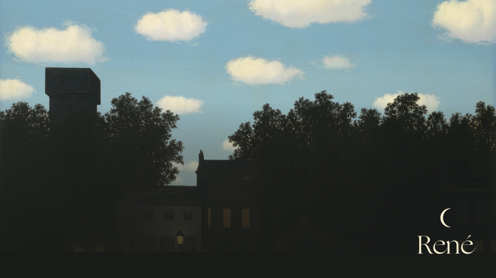

# René

René is an AR app that turns your surroundings into a René Magritte painting.

## What does it do?
1. Augment elements of René Magritte paintings onto the user's surroundings.
2. You can take picture of yourself with elements from René Magritte paintings.
3. You can read information about the painting and the artist.

## Citations & References
I got help from these examples:
* [Tracking and Visualizing Faces - Apple Developer Documentation](https://developer.apple.com/documentation/arkit/tracking_and_visualizing_faces)
* [Simple ARKit 2 Tutorial on How to Build an App with Face Tracking](https://rubygarage.org/blog/arkit-2-tutorial)
