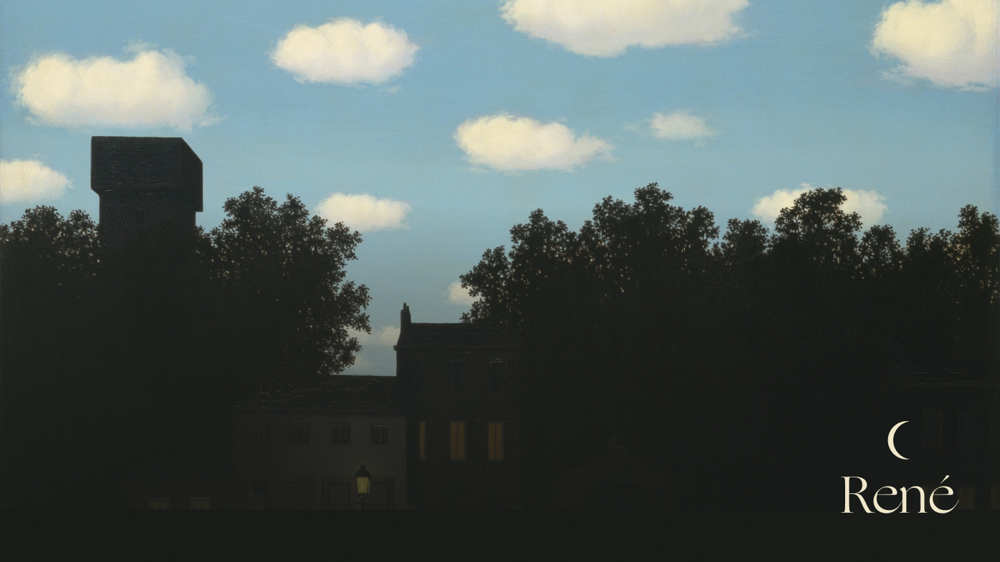
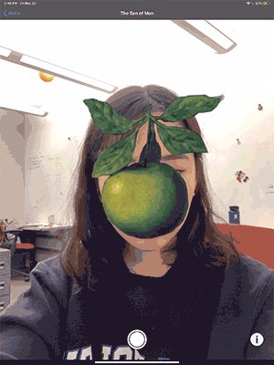
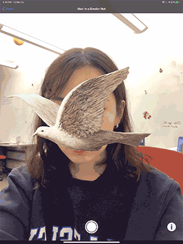

# René

René is an AR app that turns your surroundings into a René Magritte painting.

# What does it do?
1. Augment elements of René Magritte paintings.
2. Take a picture.
3. Read information about the painting and the artist.

  

 *You need a device with a TrueDepth front-facing camera for face tracking features.

# Citations & References
### Face tracking
* [Tracking and Visualizing Faces - Apple Developer Documentation](https://developer.apple.com/documentation/arkit/tracking_and_visualizing_faces)
* [Simple ARKit 2 Tutorial on How to Build an App with Face Tracking](https://rubygarage.org/blog/arkit-2-tutorial)

### Content
* Information about the artist & Man in a Bowler Hat: [https://www.renemagritte.org](https://www.renemagritte.org/man-in-a-bowler-hat.jsp)
